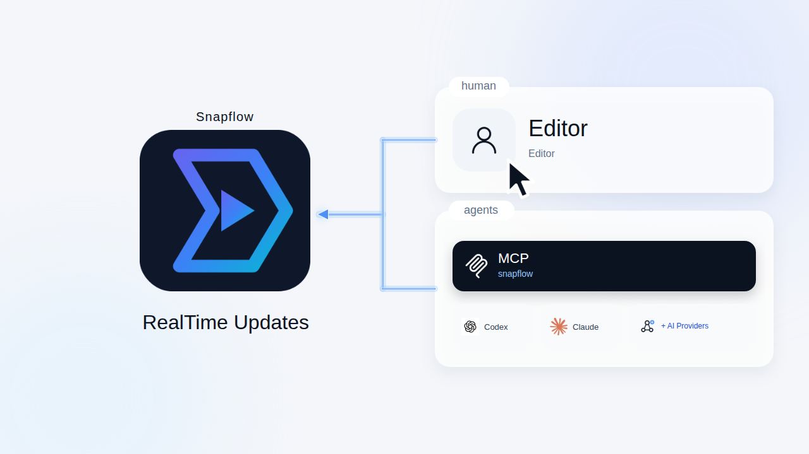

[](https://github.com/Shaik-Sirajuddin/snapflow/actions/workflows/build-linux.yml)
[](https://github.com/Shaik-Sirajuddin/snapflow/actions/workflows/build-macos.yml)

# Snapflow

Snapflow is a video editor with a builtin Agent Harness.

<div align="center">



</div>

Snapflow can be accessed by agents connecting via [MCP](https://modelcontextprotocol.io/).

## MCP tools

MCP tools made available are:

| Category | Use case | Tools count |
|---|---|---:|
| Daemon lifecycle | Create, launch, list, inspect, and close project instances | 7 |
| Project | Open, create, clone, save, undo/redo, and inspect project state | 13 |
| Selection | Select the active track or clip and read the current view | 3 |
| Editing | Add, trim, move, split, and remove timeline tracks and clips | 16 |
| Playlist and transitions | Manage playlist entries and add crossfade transitions | 8 |
| Filters and keyframes | Add, inspect, reorder, and animate MLT filters | 9 |
| Audio | Manage gain, pan, balance, normalization, and fades (when enabled) | 6 |
| Generators | Add title and color producers | 2 |
| Subtitles | Manage subtitle tracks and cues, including import/export and burn-in | 7 |
| Files | Import, probe, and export media | 3 |
| Export jobs | List, inspect, and stop export jobs | 3 |
| Playback | Control transport, seek, and render frame previews | 7 |
| Notes | Manage project notes | 2 |
| Markers | Create, update, remove, and navigate timeline markers | 10 |
| Recent files | Manage project-scoped recent file paths | 3 |

The daemon advertises 99 typed tools when the audio namespace is enabled (93
otherwise), including the 7 lifecycle tools.

## Project daemon and headless mode

Use `snapflowd` to launch and manage project instances, including headless mode.

Use Snapflow itself as an MCP server so other agents/tools can drive the editor:

```json
{
  "mcpServers": {
    "snapflow": {
      "command": "snapflow",
      "args": ["--mcp-server"]
    }
  }
}
```

## Install

One command to begin.

### Linux

🔵 **Install command**

```sh
curl -fsSL https://raw.githubusercontent.com/Shaik-Sirajuddin/snapflow/main/scripts/install.sh | bash
```

See [Build from source](#how-to-build) for a local development build.

### Windows

🔵 **Install command**

```powershell
irm -UseBasicParsing https://raw.githubusercontent.com/Shaik-Sirajuddin/snapflow/main/scripts/install.ps1 | iex
```

For Windows PowerShell 5.1, `-UseBasicParsing` avoids the web-content
confirmation prompt. You can also download the current build from the
[Snapflow release page](https://github.com/Zealbase/snapflow/releases).

### macOS

macOS support is coming soon.

For a local Linux build, assemble the production-shaped archive first, then use the
same installer without any asset environment variable:

```sh
scripts/package-local-linux.sh --output /tmp/snapflow-dist
curl -fsSL file://$PWD/scripts/install.sh \
  | bash -s -- --asset /tmp/snapflow-dist/snapflow-linux-x86_64-local-<version>.tar.gz
```

The local bundle contains the GUI, `snapflowd`, and the colocated `acpx-server`; the
installer provisions the daemon service and ACP Node runtime using its normal defaults.

To build from source instead, see "How to build" below.

## Dependencies

Snapflow's direct (linked or hard runtime) dependencies are:

- [Shotcut](https://www.shotcut.org/): the video editor Snapflow is forked from
- [MLT](https://www.mltframework.org/): multimedia authoring framework
- [Qt 6 (6.4 minimum)](https://www.qt.io/): application and UI framework
- [FFTW](https://fftw.org/)
- [FFmpeg](https://www.ffmpeg.org/): multimedia format and codec libraries
- [Frei0r](https://www.dyne.org/software/frei0r/): video plugins
- [SDL](http://www.libsdl.org/): cross-platform audio playback

## License

GPLv3. See [COPYING](https://github.com/Shaik-Sirajuddin/shotcut/blob/master/COPYING).

## Contributing

Contributions are welcome — see
[CONTRIBUTING.md](https://github.com/Shaik-Sirajuddin/shotcut/blob/master/CONTRIBUTING.md)
for how to file issues, propose changes, and the PR process.

## How to build

**Warning**: building Snapflow should only be reserved to beta testers or contributors who know what they are doing.

### Qt Creator

The fastest way to build and try Snapflow development version is through [Qt Creator](https://www.qt.io/download#qt-creator).

### From command line

First, check dependencies are satisfied and various paths are correctly set to find different libraries and include files (Qt, MLT, frei0r and so forth).

#### Configure

In a new directory in which to make the build (separate from the source):

```
cmake -DCMAKE_INSTALL_PREFIX=/usr/local/ /path/to/snapflow
```

We recommend using the Ninja generator by adding `-GNinja` to the above command line.

#### Build

```
cmake --build .
```

#### Install

If you do not install, Snapflow may fail when you run it because it cannot locate its QML
files that it reads at run-time.

```
cmake --install .
```

## Translation

If you want to translate Snapflow to another language, please use [Transifex](https://explore.transifex.com/ddennedy/shotcut/).
