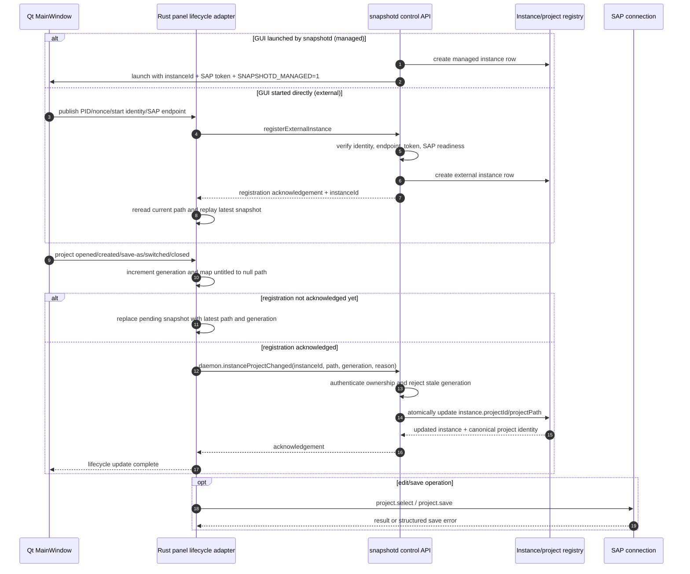

# Project-switch notification plan

## Goal

Make project changes visible to snapshotd through one daemon-owned notification
API, regardless of whether the GUI was launched by snapshotd or started
directly by the user.

## Related existing plans

This plan extends, rather than replaces, the existing `memory/build` design:

- [`snapshotd-windows-daemon-transport/00-plan.md`](../../memory/build/gen/plans/snapshotd-windows-daemon-transport/00-plan.md)
  defines the three endpoint domains (shared SDP control, per-instance SAP,
  and external discovery) and the managed-versus-external ownership invariant.
- [`panel-rust-snapshotd-recovery-findings.md`](../../memory/build/gen/plans/panel-rust-snapshotd-recovery-findings.md)
  explicitly records the active-project-switch gap and recommends an atomic
  `ensure-and-select` boundary that returns the active project and instance.

The API proposed below is the narrower notification primitive needed by that
`ensure-and-select`/rebind flow. It updates an already-owned instance; it does
not perform lookup, launch, handoff, or lease acquisition.

## Registration-readiness invariant

Project callbacks are notifications, not registration. They are valid only
after snapshotd has acknowledged ownership of the instance:

- **Managed:** the daemon creates the `ProcessInstance` row and records the
  instance ID/SAP token before the GUI can send a project notification.
- **External:** the GUI first completes `registerExternalInstance`; the
  daemon verifies PID/start identity, nonce, endpoint, token, and SAP
  readiness, then returns the authoritative instance ID.

The Rust lifecycle adapter must keep a small pending state until that
acknowledgement exists. If Qt emits `projectCreatedUntitled`, `projectOpened`,
or `projectClosed` before registration completes, the adapter stores the
latest `(path, generation, reason)` and flushes it once registration succeeds.
Each new callback replaces the pending snapshot, including a later `null`
path for close/untitled; callbacks are never queued as an unbounded FIFO.
Immediately after registration acknowledgement, the adapter rereads its
current authoritative project-path state and sends that latest snapshot with a
fresh generation. This replay is required even if no callback arrived during
the registration delay.
It must not call `instanceProjectChanged` with a missing/guessed instance ID,
and it must not silently discard the callback. Registration failure should be
observable and retried with bounded backoff.

The API must update an existing instance; it must not create a second instance
or route project ownership through the SAP edit methods.

## Current problem

There are two instance-ownership modes:

- **Managed:** `daemon.launch` creates the registry/process row and starts the
  GUI with `SNAPSHOTD_MANAGED=1`.
- **External:** the user starts the Qt GUI directly; the GUI registers its PID,
  nonce, process-start identity, SAP endpoint, and optional project path.

The native GUI already has project-open, project-created-untitled, save-as,
switch, and close callbacks. The managed path deliberately skips external
registration, but there is no clear daemon API for telling snapshotd that a
managed instance changed projects. This leaves the registry's project
association stale after a managed GUI switch.

## Proposed API

Add one daemon-only control-plane method:

```text
daemon.instanceProjectChanged
```

Request:

```json
{
  "instanceId": "instance-id",
  "projectPath": "C:\\work\\edit\\project.mlt",
  "projectType": "folder",
  "generation": 42,
  "reason": "opened|created|save_as|switched|closed"
}
```

`projectPath` is nullable for the untitled/closed state. The daemon resolves
the project path to its canonical project identity and updates the existing
`ProcessInstance` atomically. `generation` makes retries and out-of-order
callbacks harmless: an older generation is ignored.

The daemon derives `instanceId` from the authenticated/owned control session
where possible. A caller may only update an instance it owns:

- managed child: verify the daemon instance row, PID, and SAP token;
- external child: verify the registered nonce, PID/process-start identity, and
  SAP endpoint/token.

`daemon.instanceProjectChanged` must not launch a process, register an external
instance, or mutate another user's project.

## Unified sequence



## Implementation sequence

1. **Define the protocol contract**
   - Add request/response types and schema documentation.
   - Define nullable untitled/closed semantics, reasons, and generation rules.

2. **Add the daemon method**
   - Implement `daemon.instanceProjectChanged` in the control dispatcher.
   - Add ownership checks for managed and external rows.
   - Canonicalize Windows paths with `filepath.Clean`/`filepath.Abs` and use
     the existing project identity lookup.
   - Make the registry update transactional and idempotent.

3. **Expose one Rust client call**
   - Add `instance_project_changed(...)` to the snapshotd control client.
   - Preserve the existing retry/timeout behavior.
   - Surface an acknowledgement and structured error to the lifecycle caller.

4. **Gate callbacks on registration**
   - Represent registration as `Pending`, `Acknowledged(instanceId)`, or
     `Failed(retryable error)`.
   - Queue only the latest project notification while registration is pending.
   - Flush it after acknowledgement, preserving its generation and reason.
   - Add a daemon-side rejection for unknown, unowned, or not-yet-ready IDs.

5. **Unify Qt lifecycle callbacks**
   - Route `projectOpened`, `projectCreatedUntitled`, save-as, project switch,
     and `projectClosed` through the same adapter.
   - Keep external registration only for the initial self-launched instance.
   - Do not call `registerExternalInstance` for `SNAPSHOTD_MANAGED=1` children.
   - Send `projectPath: null` for untitled and closed states.

6. **Make save errors observable**
   - Keep native Qt's existing `showSaveError()` behavior.
   - Return a structured SAP error (`code`, `path`, `reason`) for panel/MCP
     saves after lifecycle acknowledgement succeeds.

7. **Add regression coverage**
   - External instance: register untitled, open, save-as, switch, close.
   - Managed instance: launch, switch, save-as, close without external-row
     creation.
   - Duplicate and out-of-order generations.
   - Callback emitted before external registration: notification is queued and
     delivered after registration acknowledgement.
   - Registration failure/timeout: no notification is sent with a guessed ID,
     and the pending state is retried or surfaced.
   - Managed callback before the registry row is ready: startup ordering blocks
     the callback until the managed row is acknowledged.
   - Unauthorized instance updates and PID/start-identity mismatch.
   - Windows named-pipe and Windows-path tests, with cross-compilation in Linux
     CI and native execution in Windows CI.

## Acceptance criteria

- `daemon.list` reports the current project association for both instance modes.
- A self-launched untitled GUI is visible to snapshotd before its first save.
- No project notification is sent before instance registration is acknowledged.
- A managed GUI switch updates the existing row without creating an external
  row or launching a duplicate process.
- Replayed notifications do not change state; older generations are ignored.
- Windows paths containing spaces, Unicode, and backslashes round-trip exactly.
- A failed save reaches the correct caller as either Qt's native dialog or a
  structured panel/MCP error, without being silently discarded.
