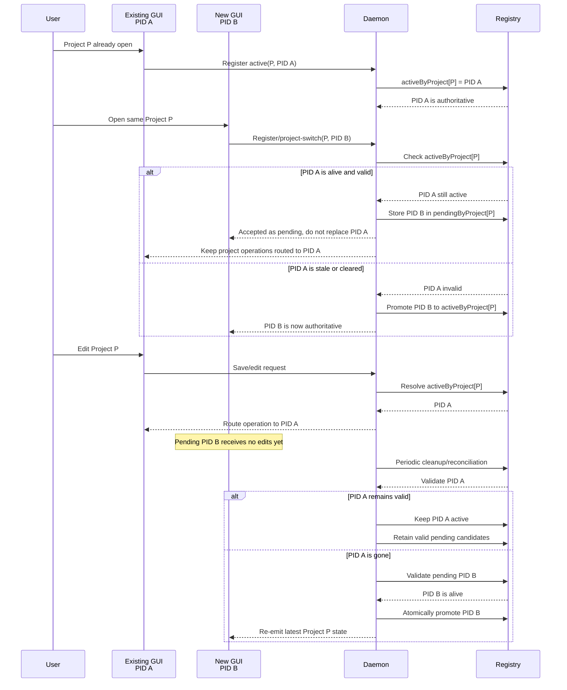

# Project Switch Active/Pending Ownership

The daemon keeps one authoritative instance per project. Conflicting
notifications are retained as pending candidates rather than replacing the
active instance.

Each pending candidate should retain its PID/process-start identity, instance
ID/nonce, project path, lifecycle generation, and last-seen timestamp. Cleanup
must validate the active owner first, then promote the newest valid candidate
only after the active owner is confirmed stale.
