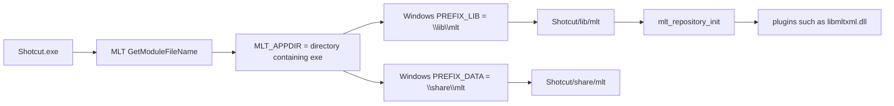
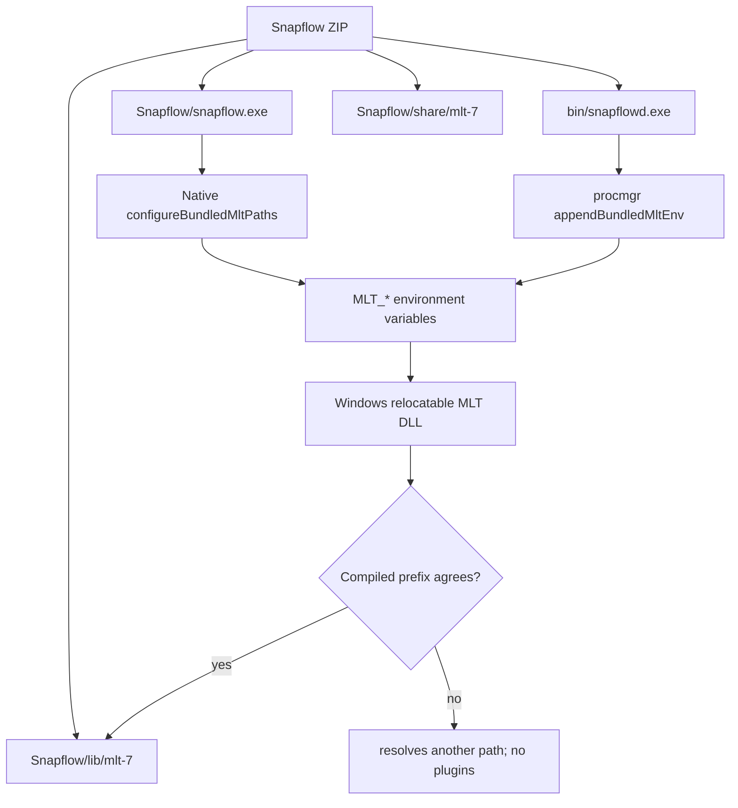
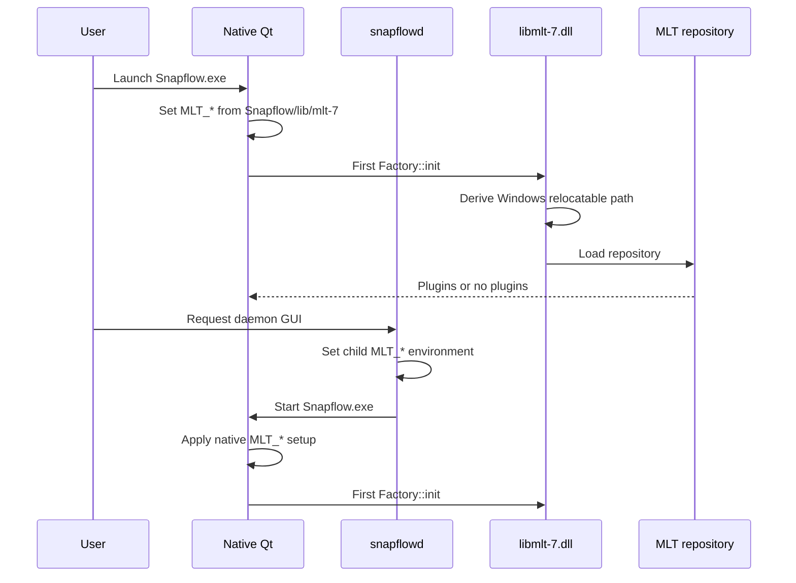
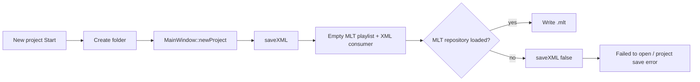

# Windows MLT layout: upstream Shotcut vs Snapflow

This note records how upstream Shotcut packages MLT on Windows, how MLT
resolves its repository, and where the current Snapflow bundle differs.

## Sources

- [Upstream Shotcut Windows workflow](https://github.com/mltframework/shotcut/blob/master/.github/workflows/build-windows.yml)
- [Upstream Shotcut MSYS2 build script](https://github.com/mltframework/shotcut/blob/master/scripts/build-shotcut-msys2.sh)
- [Upstream MLT resolver](https://github.com/mltframework/mlt/blob/master/src/framework/mlt_factory.c)
- Snapflow: `.github/workflows/build-windows.yml`, `snapshotd/internal/procmgr/procmgr.go`, and `shotcut/src/main.cpp`

## Upstream Shotcut layout and resolution

The upstream workflow builds and zips a `build/Shotcut` directory. MLT is
configured with the same install prefix as Shotcut, so the deployed tree is:

```text
build/Shotcut/
├── Shotcut.exe
├── lib/
│   ├── libmlt-7.dll
│   └── mlt/
│       ├── libmltcore.dll
│       ├── libmltxml.dll
│       └── ...
└── share/mlt/
    ├── profiles/
    └── ...
```

For a deployed Windows build, MLT computes `MLT_APPDIR` from the executable
path and uses its compiled relocatable defaults:

```text
repository = <MLT_APPDIR>\lib\mlt
data       = <MLT_APPDIR>\share\mlt
```

`MLT_REPOSITORY` is documented as ignored by Windows relocatable builds. The
repository therefore must be placed where the loaded MLT DLL resolves it;
setting an environment variable cannot repair a mismatched package layout.



## Current Snapflow layout

The current Snapflow workflow installs a prebuilt MSYS2 MLT package. Its
source module directories are unversioned (`/mingw64/lib/mlt` and
`/mingw64/share/mlt`), but the workflow copies them into versioned destinations:

```text
C:\Users\<user>\AppData\Local\snapflow\
├── bin/snapflowd.exe
└── Snapflow/
    ├── snapflow.exe
    ├── libmlt-7.dll
    ├── lib/mlt-7/        # current destination (wrong Windows name)
    └── share/mlt-7/      # current destination (wrong Windows name)
```

Native Qt and `procmgr` both set `MLT_REPOSITORY`, `MLT_DATA`, and
`MLT_PROFILES_PATH` to those `Snapflow`-local versioned directories. However,
the Nitro release log resolves the loaded DLL to:

```text
C:\Users\siraj\AppData\Local\snapflow\lib\mlt
```

That proves the loaded MLT DLL's compiled Windows prefix does not match the
packager's chosen `Snapflow/lib/mlt-7` destination. The Windows branch of
MLT's source uses `\\lib\\mlt` and `\\share\\mlt`; `mlt-7` belongs to the
non-Windows `RELOCATABLE` branch.



## Native and daemon sequence



## Why new-project creation fails

`NewProjectFolder::on_startButton_clicked()` creates the folder and calls
`MainWindow::newProject()`. `newProject()` immediately calls `saveXML()`,
which creates an empty MLT playlist and XML consumer. If MLT loaded no
repository plugins, that consumer is invalid and the save returns false. The
UI then reports the generic failure:

```text
mlt_repository_init: no plugins found
Failed to open ""
```

This occurs before a daemon `project.create` request is involved.



## Canonical fix options

Choose one end-to-end strategy:

1. Match upstream Windows: build/use an MLT DLL with the Windows `lib/mlt`
   prefix, ship `Snapflow/lib/mlt` and `Snapflow/share/mlt`, and ensure the
   DLL resolves `MLT_APPDIR` to `Snapflow`.
2. If the prebuilt DLL was compiled with `NODEPLOY` (as Nitro's parent-root
   log suggests), ship `lib/mlt` and `share/mlt` at the parent root it derives,
   and make native Qt and `procmgr` use that same root.

Do not mix a prebuilt unversioned-prefix DLL with versioned-only module
directories. The verification must use a freshly started executable and check
the first `mlt_repository_init` path, not only `.snapflow-version`.
