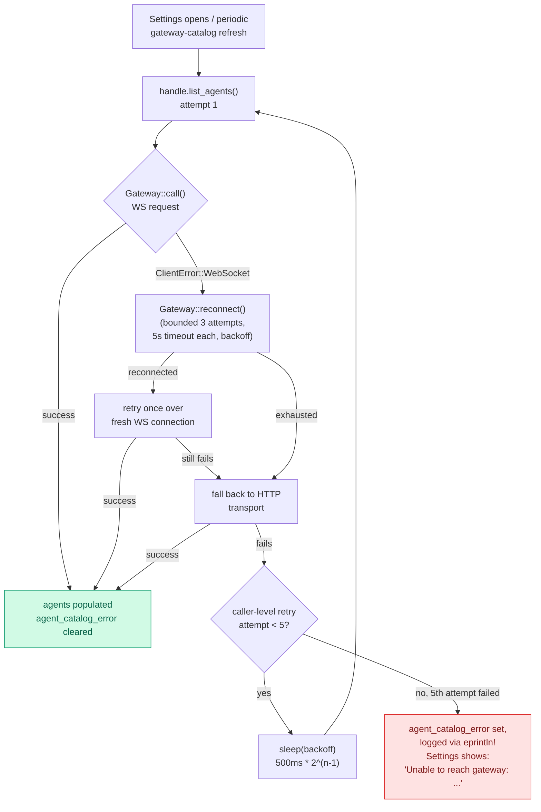

# `agents/list` retry-until-success-with-fallback

## Summary

`agents/list` (the RPC Settings' Agents catalog reads from, via
`AgentBridge::list_agents`/the background gateway-catalog refresh in
`agent_bridge.rs`) now retries with backoff on top of the transport's own
reconnect-and-HTTP-fallback logic, instead of surfacing a failure the
moment the very first attempt returns an error. A prior fix already made
failures *visible* (`agent_catalog_error`, shown in `agents_view.slint` as
"Unable to reach gateway: <error>") instead of silently rendering as an
empty catalog — this change reduces how often that visible error actually
needs to appear in the first place.

## Why this needed its own layer, on top of what the transport already does

`acpx-client`'s `Gateway::call()` already does real work before an error
ever reaches a caller, for any method other than `session/new` (which
`agents/list` is not):

1. On a WebSocket failure, it reconnects (`Gateway::reconnect`: up to 3
   attempts, 5s timeout each, linear backoff) and retries the call once
   more over the fresh connection.
2. If reconnecting never succeeds, it falls back to a completely separate
   HTTP transport (`self.http.call(...)`) rather than giving up.

So for a caller to see `agents/list` fail at all, **both** the WS
reconnect *and* the HTTP fallback already had to fail — a much stronger
condition than an ordinary few-second connection blip (which live nitro
logs, checked as part of this investigation, showed the transport
recovering from on its own every time). The caller-level retry added here
exists for the residual case that condition still leaves: a genuinely
slow-to-come-up gateway (not merely a socket hiccup) that might still
recover a few seconds later, where retrying the *whole* transport
sequence again — not just one more WS attempt — gives it that chance
before Settings shows an error.

## What changed

`agent_bridge.rs`'s background gateway-catalog refresh (the
`self.runtime.spawn(async move { ... })` block feeding
`GatewayCatalogCache`) wraps `handle.list_agents()` in a bounded
retry-with-backoff loop instead of calling it once:

- Up to 5 attempts total.
- Backoff doubles each time: 500ms, 1s, 2s, 4s between attempts (~7.5s
  added worst-case latency before giving up).
- Runs alongside `list_profiles`/`list_mcp_servers`/
  `list_sessions_for_agent` via the same `tokio::join!` as before — those
  three are unaffected, no new latency added to them.
- On exhausting all 5 attempts, behavior is unchanged from the prior fix:
  the error is logged (`eprintln!`), `agent_catalog_error` is set, and the
  catalog degrades to empty — now representing "genuinely couldn't reach
  the gateway after real effort," not "the first attempt happened to lose
  a race."
- A later successful refresh still clears `agent_catalog_error` back to
  empty, same as before.

Bounded, not literal "retry forever" — a truly dead gateway still needs to
surface as a visible error rather than spin silently with no feedback.

## Flow

## Verification

- `cargo check --lib` (panel-rust): clean, no new warnings introduced by
  this change (pre-existing dead-code warnings only).
- Live evidence checked on a running instance (`nitro`, 2026-08-05):
  every `agents/list` request observed in `acpx-server`'s own log
  (`~/.local/state/shotcut/rui-thread-cache/gateway-codex.stderr.log`)
  succeeded with no logged error — meaning this specific instance never
  actually exercised the transport's reconnect/HTTP-fallback path for
  `agents/list`, let alone this new caller-level retry. The retry exists
  for the failure mode the design analysis above identifies, not one
  reproduced live in this session -- worth re-checking logs after a
  genuine gateway outage to confirm the retry path fires as designed.
