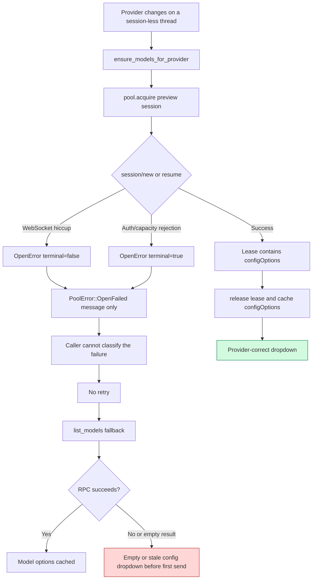
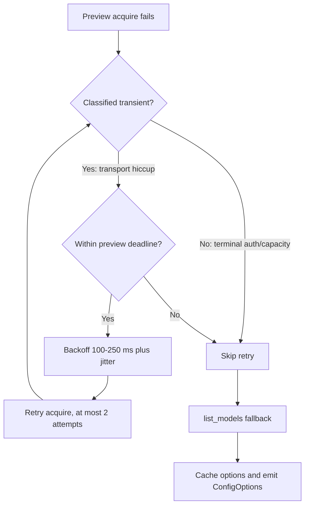
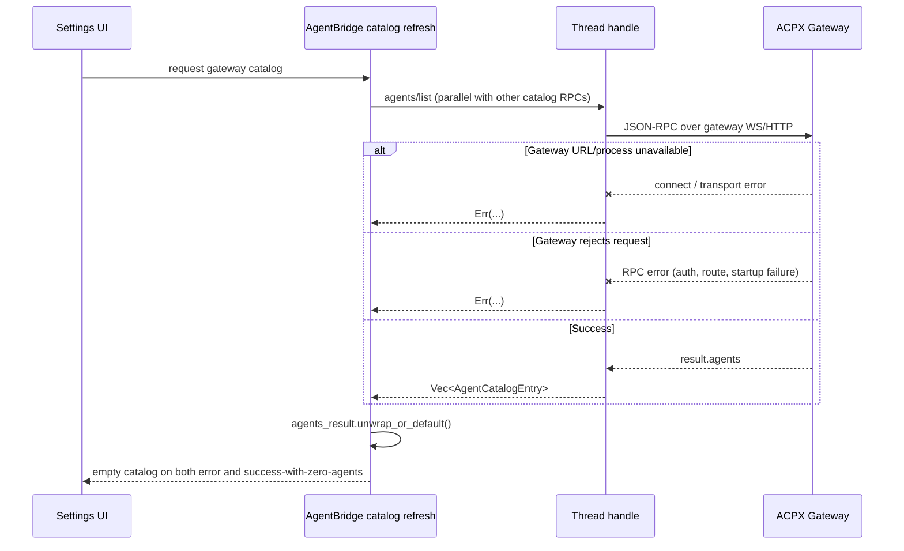

# Pre-send config-options visibility

## Location note

Plans in this repo normally live under `memory/<area>/gen/plans/<slug>/` (a
submodule). That submodule is not checked out in this worktree
(`.claude/worktrees/pool-capability-fix`), so this plan lives at
`panel-rust/docs/plans/pre-send-config-options-visibility/` instead —
inside the actual crate whose behavior it verifies, alongside the existing
`panel-rust/docs/settings-control-inventory.md`. Move it into `memory/`
once that submodule is available in this worktree, if the project wants
it there for cross-session continuity.

## Context

While live-verifying the `pool-capability-fix` branch (cross-thread pooled
session config leak fix in `thread_actor.rs`, plus an unrelated codex-acp
ChatGPT-login auth-detection fix in `acpx-server/config.rs` and
`agent_bridge.rs`), the user flagged a real gap in what had actually been
tested: every scenario so far (`pool_capability_reset_e2e_test.rs`, the
`pool-*` MCP scenarios in `host_e2e_mcp_driver.py`) checks a thread's
`configOptions` only **after** a message has been sent (`wait_for_new_
thread_state_files` waits for the trailer/runtime file a *send* creates).
Nothing has verified that `ChatInputLayout`'s config/provider dropdown is
actually populated and usable **before** the first send — the state a
user actually sees and needs, since that's when they'd pick a model/
provider in the first place.

## What's already known from code (not yet runtime-verified)

- `chat_input_layout.slint`'s `config-dropdown`
  (`visible: root.config-dropdown-entries.length > 0`) is driven by
  `AgentBridge::config_options_for_provider` (`agent_bridge.rs`).
- For a thread with **no session yet** (`acp_session_id` still `None`,
  the pre-send state for every freshly created thread), that function
  currently reads `slot.config_options` unconditionally when non-empty,
  else falls back to `slot.pre_session_model_options` — see this
  session's own edit to `config_options_for_provider` (removed an
  `attached`-gated read that regressed `restored_interaction_snapshot_
  is_available_before_gateway_events_arrive`).
- `slot.config_options` is written **only** by `store_capability_event`,
  fed only by a real attached session's own live events, or by cold-start
  restore from a persisted `ThreadRuntimeSnapshot` at slot construction.
  A brand-new thread has neither, so it starts empty.
- `slot.pre_session_model_options` is written by `AgentBridge::ensure_
  models_for_provider`, which does a **pool preview** (`pool.acquire` /
  `pool.release`, no session attach) keyed by
  `(project_dir, provider, profile)`, and is the intended source for
  pre-send population. `ChatInputLayout`'s provider-switch handler is
  expected to call this when the compose bar's provider selection
  changes on a session-less thread (see `ensure_models_for_provider`'s
  own doc comment: "intentionally not limited to deferred threads:
  changing provider on any session-less thread must repopulate the model
  dropdown immediately").
- None of this has actually been watched happen live. The two live
  attempts this session that touched provider selection
  (`codex-acp` → `claude-acp`) were for auth debugging, not for checking
  dropdown population timing, and in fact surfaced a **separate,
  unexplained bug**: selecting `claude-acp` in the UI did not redirect
  the real attach target (attach kept failing with the openai/codex auth
  error even after the compose bar visibly showed `claude-acp ›`) — this
  may or may not be related to what this plan is checking and should be
  re-examined as part of phase 2 below.

## Open question this plan answers

Does the config/provider dropdown in `ChatInputLayout` actually show
non-empty, provider-correct options **before** the user sends anything,
for more than one provider, on a real running instance — or does it stay
empty/stale until first send (or, per the `claude-acp` anomaly above,
silently keep targeting the wrong provider)?

## Verification approach

Use the same Slint-MCP element-tree inspection already used live this
session (`get_element_tree` / `find_elements_by_id` against
`ChatInputLayout::compose`, `SearchableDropdown`'s `entry.label`
accessible-labels), but read the config-dropdown's element state
**before** any `dispatch_key_event`/send on a freshly created thread —
not the post-send `*.runtime.json` polling every existing scenario uses.
Concretely: open a new thread, do **not** send, open the config dropdown
via its trigger's accessible label, and assert the option rows found
match that provider's real advertised models (not empty, not stale from
a different provider).

Can run either against the mock-agent-backed `host_e2e_mcp_smoke.sh`
harness (deterministic, fast, matches this repo's own established
`pool-*` scenario convention) or the live real-backend VNC instance now
that codex-acp auth auto-detection works — mock is preferred for the
matrix rows themselves since it doesn't depend on live provider auth;
the live instance is worth one confirming pass given the `claude-acp`
routing anomaly found above needs a real multi-provider setup to
reproduce.

## Capability-preview WS hiccup: current failure and proposed handling

Today, a transient WebSocket failure while `ensure_models_for_provider`
opens its capability-preview session is treated the same as a permanent
failure. `ProjectSessionPool::open_session` already knows whether an
`OpenError` is terminal, but `PoolError::OpenFailed` currently retains only
the message. The caller therefore cannot safely distinguish a retryable
launch-time transport hiccup from authentication/capacity rejection.

The recommended fix keeps retry policy narrow to this background probe:
preserve the terminal flag (or expose `PoolError::is_retryable()`), retry only
non-terminal failures with a short overall deadline and bounded backoff, then
use the existing `list_models` fallback. Do not blindly retry every
`session/new` globally: if the WS drops after the server creates a session but
before the response arrives, another `session/new` can create an orphaned
session. A dedicated idempotency key or capability-probe RPC would be needed
before making session creation globally retryable.

## Why `agents/list` can disappear from Settings

This is a separate failure layer from preview-session idempotency. Settings
does not call the preview pool. Its catalog refresh calls `profiles/list`,
`mcp_servers/list`, `agents/list`, and `session/list` through the selected
thread's gateway handle. The refresh currently converts every failed result to
an empty value with `unwrap_or_default()`, so a connection/RPC failure is
rendered as “no agents” rather than as an error.

Therefore the first diagnostic fix is not an idempotency retry: preserve and
log the `agents/list` error (including gateway URL and provider), expose a
distinct `agents_fetch_error`/loading state in the Settings snapshot, and run
a direct gateway health probe. Only after that identifies a transient startup
or WS disconnect should we add a reconnect/retry policy. A preview `acquire`
retry cannot make Settings show agents when the selected gateway itself is
unreachable, mis-provisioned, or its error is being silently converted to an
empty list.
