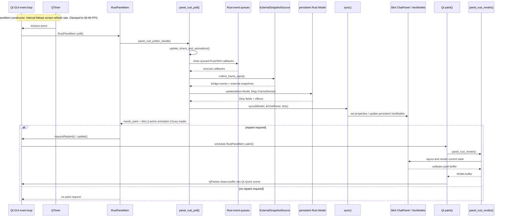

# Qt-Rust panel refresh sequence

This diagram shows how a Qt timer refreshes the Rust/Slint UI model and how
the updated model becomes pixels on screen.



## Entry points and update points

| Stage | Source | Responsibility |
|---|---|---|
| Timer creation | [`rustpanelitem.cpp`](../../shotcut/src/qmltypes/rustpanelitem.cpp:111) | Connects `QTimer::timeout` to `RustPanelItem::poll()` and starts the timer. |
| Qt callback | [`rustpanelitem.cpp`](../../shotcut/src/qmltypes/rustpanelitem.cpp:379) | Calls `panel_rust_poll()` and requests repaint when Rust returns `true`. |
| Rust FFI entrypoint | [`lib.rs`](../src/lib.rs:3427) | Advances animations, drains queues, polls frame state, and returns repaint status. |
| Frame dispatch | [`dispatch.rs`](../src/dispatch.rs:1484) | Collects the external frame and sends it through the update pipeline. |
| Persistent model update | [`dispatch.rs`](../src/dispatch.rs:132) | Mutates the live Rust `Model` using `update()`. |
| Slint projection | [`sync.rs`](../src/sync.rs:20) | Applies `Dirty` changes to Slint properties and persistent list models. |
| Qt paint callback | [`rustpanelitem.cpp`](../../shotcut/src/qmltypes/rustpanelitem.cpp:398) | Calls `panel_rust_render()` and paints the resulting buffer. |

The timer is therefore still delivered by Qt's event loop, but Qt does not
own the application model. Qt supplies the tick; Rust updates the model and
Slint projection; Qt finally displays the rendered buffer.

## Minimal update plan: use the Qt Quick window clock

Replace the independent `RustPanelItem::m_pollTimer` with the
`QQuickWindow::afterAnimating` callback from the `QQuickWidget`'s associated
offscreen window.

1. Add a `QMetaObject::Connection` member for the current Quick window.
2. In `windowChanged`, disconnect the old window and connect the new window's
   `afterAnimating` signal to `RustPanelItem::onQuickFrame()`.
3. Start the first frame with `quickWindow->update()` when the panel becomes
   visible. Do not gate this on keyboard focus.
4. In `onQuickFrame()`:

   ```cpp
   if (!m_handle || !isVisible())
       return;

   if (panel_rust_poll(m_handle))
       update();

   // Keep afterAnimating active while this panel is visible.
   window()->update();
   ```

5. Stop requesting frames when the dock is hidden, minimized, or destroyed.
6. Keep all Rust model, Slint, and `panel_rust_render()` calls on the GUI
   thread. Background agent work must continue to communicate through queues.
7. Keep `QSG_RENDER_LOOP=basic` until the Rust `thread_local!` panel state is
   replaced with an explicit cross-thread design.

This removes the fixed 60-90 FPS timer and makes the panel follow the
`QQuickWidget` window's own Qt Quick update cadence. `afterAnimating()` alone
is not sufficient: calling `window()->update()` after each active frame is
what keeps the clock alive when the panel has no keyboard focus.
