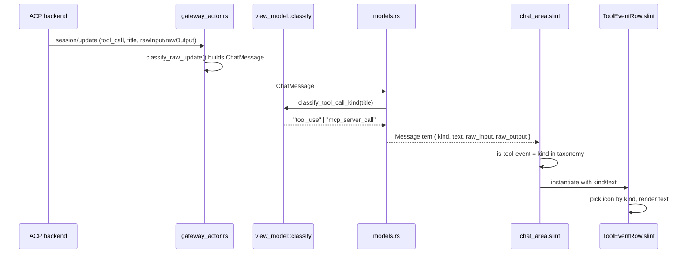

# panel-rust/ui component library

Five layers, each only allowed to depend on the layer(s) above it.

```
ui/
  tokens/
    colors.slint       # raw color scale, no meaning attached (color-neutral-50..950, color-brand-*)
    typography.slint    # font-family / font-size / font-weight scale
    metrics.slint        # spacing / radius / stroke scale
    theme.slint           # merges the three into one `Theme` global, resolves light/dark
  base/                 # shadcn-tier primitives: unopinionated, app-agnostic, styled ONLY from `Theme`
    button.slint
    input.slint
    card.slint
    dialog.slint
    tabs.slint
    tooltip.slint
    scroll-area.slint
  components/         # SHARED app-specific components -- used by 2+ pages/views
    thread-item.slint
    message-bubble.slint
    chat-input.slint
    status-chip.slint
  pages/              # one directory per page/view -- the screen-level unit
    chat/
      chat-view.slint       # the page's root component, exported and mounted by app.slint
      components/            # page-LOCAL components -- only chat-view.slint imports these
        thread-list.slint
        message-timeline.slint
    settings/
      settings-view.slint
      components/
        profile-editor.slint
        mcp-server-row.slint
  app.slint           # root composition: picks the active page, mounts its *-view.slint
```

Rule of thumb: **tokens never reference base/, base/ never references components/ or pages/, components/ never reference pages/.** If a `base/` component needs app knowledge, it's not a base component — move it to `components/`. If a `components/` piece is only ever used inside one page, it's not shared — move it into that page's own `components/` subfolder instead.

## Layer 5 — `pages/` (screen-level views, each with its own local components)

A **page/view** is the unit `app.slint` switches between (chat vs settings vs, say, a future onboarding screen). Each page directory owns:

- exactly one `*-view.slint` — the page's root component, the only thing `app.slint` imports from that page
- its own `components/` subfolder for pieces that only make sense inside that page (a `thread-list.slint` only the chat view ever mounts doesn't belong in the shared `components/`, since nothing outside chat needs it)

```slint
// pages/chat/chat-view.slint
import { Theme } from "../../tokens/theme.slint";
import { ChatInput, MessageBubble } from "../../components/index.slint"; // shared
import { ThreadList } from "./components/thread-list.slint";              // page-local

export component ChatView {
    in property <[ThreadItem]> threads;
    in property <[MessageItem]> messages;
    HorizontalLayout {
        ThreadList { threads: threads; }         // only chat-view uses this
        VerticalLayout {
            for m in messages: MessageBubble { item: m; }  // shared across pages
            ChatInput { }
        }
    }
}
```

```slint
// app.slint
import { ChatView } from "pages/chat/chat-view.slint";
import { SettingsView } from "pages/settings/settings-view.slint";

export component App {
    in property <string> active-page: "chat";
    if active-page == "chat" : ChatView { /* ... */ }
    if active-page == "settings" : SettingsView { /* ... */ }
}
```

Decision rule for where a component lives: **used by exactly one page → that page's `components/`. Used by 2+ pages → shared `components/`. Has zero app/domain knowledge → `base/`.**

Inheriting from a `base/` primitive is optional, not mandatory — a `components/` or page-local component with no sane `base/` fit (a custom terminal grid, a bespoke bubble-tail shape) can build straight from `Rectangle`/`Text`/`Path`. The one non-negotiable rule regardless of what it inherits from: **never hardcode a color/size — always read it off `Theme`.**

## Layer 1 — tokens (the Tailwind "config")

Raw values, no semantics. Same idea as Tailwind's `colors.slate[50..950]` before it's assigned to `bg-background`.

```slint
// tokens/colors.slint
export global ColorScale {
    out property <color> neutral-50: #fafafa;
    out property <color> neutral-900: #171717;
    out property <color> brand-500: #6366f1;
    out property <color> brand-600: #4f46e5;
    // ...
}
```

## Layer 2 — `Theme` global (the Tailwind "utility class" stand-in)

Slint has no class attribute, so the utility-class layer becomes **one global with utility-shaped property names**. A component "applies a class" by binding to `Theme.<name>` instead of writing `class="bg-primary text-muted"`.

```slint
// tokens/theme.slint
export global Theme {
    in property <bool> dark: true;

    // bg-*
    out property <color> bg-canvas:   dark ? ColorScale.neutral-900 : ColorScale.neutral-50;
    out property <color> bg-surface:  dark ? ColorScale.neutral-800 : #ffffff;
    out property <color> bg-primary:  ColorScale.brand-500;

    // text-*
    out property <color> text-primary: dark ? ColorScale.neutral-50 : ColorScale.neutral-900;
    out property <color> text-muted:    dark ? #a1a1a6 : #71717a;

    // border-*
    out property <color> border-default: dark ? #ffffff26 : #00000014;

    // font-*
    out property <string> font-sans: "Inter";
    out property <length> text-sm: 12px;
    out property <length> text-base: 13px;

    // radius-* / space-*
    out property <length> radius-sm: 4px;
    out property <length> radius-md: 8px;
    out property <length> space-2: 8px;
    out property <length> space-4: 16px;
}
```

Naming convention (mirrors Tailwind's utility prefixes so it reads the same way):

| prefix | meaning | example |
|---|---|---|
| `bg-*` | fill color | `Theme.bg-surface` |
| `text-*` (color) | text color | `Theme.text-muted` |
| `text-*` (size, non-color) | font size | `Theme.text-sm` |
| `border-*` | border color | `Theme.border-default` |
| `radius-*` | corner radius | `Theme.radius-md` |
| `space-*` | spacing/padding/gap | `Theme.space-4` |
| `font-*` | font family/weight | `Theme.font-sans` |

## Layer 3 — `base/` (shadcn-equivalent primitives)

Generic, reusable, zero app knowledge — same role shadcn's copy-pasted primitives play. Styled exclusively off `Theme`, exposes plain `in`/`callback` props, no business data types.

```slint
// base/button.slint
import { Theme } from "../tokens/theme.slint";

export component Button {
    in property <string> label;
    in property <bool> primary: false;
    callback clicked();
    Rectangle {
        background: primary ? Theme.bg-primary : Theme.bg-surface;
        border-radius: Theme.radius-md;
        border-color: Theme.border-default;
        border-width: 1px;
        Text {
            text: label;
            color: primary ? #ffffff : Theme.text-primary;
            font-size: Theme.text-sm;
        }
        TouchArea { clicked => { root.clicked(); } }
    }
}
```

## Layer 4 — `components/` (custom, app-specific)

Composed from `base/` + `Theme`, but now allowed to know about domain types (`ThreadItem`, `MessageItem`, ...).

```slint
// components/thread-item.slint
import { Theme } from "../tokens/theme.slint";
import { Card } from "../base/card.slint";
import { ThreadItem } from "../types.slint";

export component ThreadItemView {
    in property <ThreadItem> item;
    Card {
        VerticalLayout {
            padding: Theme.space-2;
            Text { text: item.name; color: Theme.text-primary; }
            Text { text: item.description; color: Theme.text-muted; font-size: Theme.text-sm; }
        }
    }
}
```

## ACP -> messages -> view-model -> component pipeline

This is already a real, enforced separation in the code (`chat-items-redesign.md`'s
Rust-reality-check + this session's `chat_area.slint` routing change), just
not previously written down as its own architecture note. No `.slint`
component (`UserBubble`, `ToolEventRow`, `MessageCard`, ...) references ACP,
`ChatMessage`, or any wire shape -- they only ever take plain strings/bools
as props. The classifier that decides *which* component renders is fully
separate from the components themselves.

### Proposed minimal folder (Rust side)

Today this classification logic is split across `gateway_actor.rs`
(wire-facing) and `models.rs` (Rust type -> Slint type). Both already exist
and work; this is a naming/grouping proposal, not a rewrite -- pulling the
"picks the view-model kind" half out of `models.rs` into its own small
module makes the boundary explicit instead of implicit:

```
src/
  gateway_actor.rs        (unchanged -- ACP wire JSON -> ChatMessage)
  view_model/
    mod.rs                 -- re-exports the two functions below
    classify.rs             classify_tool_call_kind, message_kind_str
                             (moved from models.rs, logic unchanged)
  models.rs               (unchanged otherwise -- ChatMessage/TranscriptItem -> MessageItem,
                            calls into view_model::classify)
```

### Class diagram: the full pipeline

```mermaid
classDiagram
    class RawWireJson {
        <<serde_json::Value>>
        session/update notification
    }
    class ChatMessage {
        +MessageKind kind
        +String text
        +Option~String~ status
        +Option~Value~ raw_input
        +Option~Value~ raw_output
    }
    class ViewModelClassifier {
        <<view_model::classify>>
        +classify_tool_call_kind(title) str
        +message_kind_str(kind, title) str
    }
    class MessageItem {
        <<Slint struct, the view-model>>
        +string kind
        +string text
        +string raw_input
        +string raw_output
    }
    class ChatAreaRouter {
        <<chat_area.slint>>
        for msg in messages
        +is_user bool
        +is_tool_event bool
    }
    class UserBubble
    class ToolEventRow
    class MessageCard

    RawWireJson --> ChatMessage : classify_raw_update() [gateway_actor.rs]
    ChatMessage --> ViewModelClassifier : message_kind_str()
    ViewModelClassifier --> MessageItem : models::to_message_model()
    MessageItem --> ChatAreaRouter : messages: [MessageItem]
    ChatAreaRouter --> UserBubble : kind == "user"
    ChatAreaRouter --> ToolEventRow : kind in [tool_use, mcp_server_call, skill_load, skill_use]
    ChatAreaRouter --> MessageCard : kind in [agent, thinking]
```

### Sequence: one tool call, wire to pixel



Neither diagram changes anything about current behavior -- this documents
the boundary that already exists so the next component added to the
taxonomy (skill_load/skill_use once classification is confirmed, per
`chat-items-redesign.md`'s reality-check section) has a clear seam to land
in (`view_model::classify`), not a guess about where classification logic
belongs.

## Migration note

The existing `ui/palette.slint` already plays the role of `tokens/theme.slint` (its `sys-*` roles == the `bg-*`/`text-*`/`border-*` prefixes above, just without the prefix convention). Migrating means: split it into `tokens/colors.slint` + `tokens/typography.slint` + `tokens/metrics.slint` + a `Theme` global that renames `sys-primary` → `bg-primary`, `sys-text-primary` → `text-primary`, etc., then introduce `base/` as a new directory sitting between `Theme` and the existing `components/`/`layouts/` files (which keep working, just start consuming `base/` primitives instead of hand-rolling `Rectangle`+`Text` each time).
