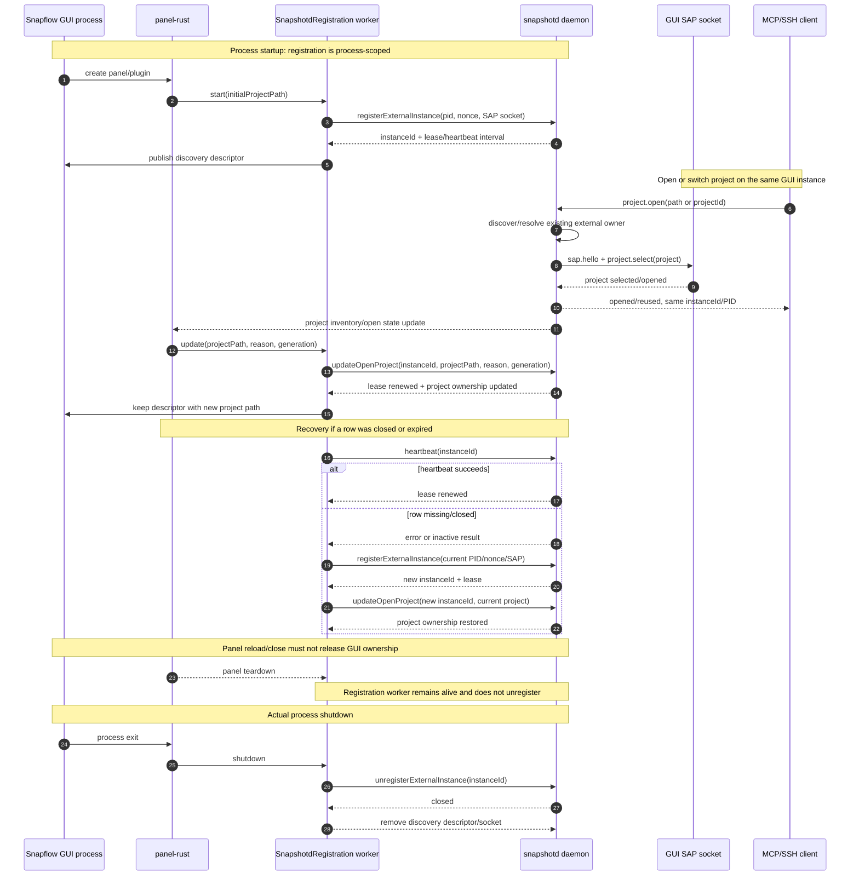

# Live project propagation lifecycle

This sequence describes the intended ownership model: one external registration
per Snapflow GUI process, with project selection represented as an update to
that registration. The registration is released only when the GUI process exits.

## Ownership recommendation

Use a global process-level registration, not one registration per project.

| Concern | Owner | Cardinality | Lifetime |
| --- | --- | --- | --- |
| GUI process identity, PID, nonce, SAP endpoint | `SnapshotdRegistration` | one per Snapflow process | process start → process exit |
| Active project path/id/generation | registration state | zero or one per process | project open/switch → next switch/close |
| Daemon-owned headless process | `ProcessInstance` | one per live daemon child | child start → child exit |
| Project registry row | `Project` | one per project path | persistent |

The process-level model matches the existing GUI architecture: one Snapflow
process owns one SAP endpoint and can change its selected project. A per-project
registration would incorrectly imply that switching projects requires a new GUI
process or multiple SAP owners. It is appropriate only if the product later
supports multiple independent GUI processes, each with its own endpoint.

The daemon may still keep project-level lookup indexes, but those indexes should
point to the process-level instance. In other words:

```text
GUI process (PID 23299)
  └── external instance (one registration, one SAP socket)
        └── active project: record.mlt → another project on switch
```



## Invariants

- A project switch changes `projectPath`, `projectId`, `generation`, and
  lifecycle reason; it does not create a second GUI process.
- `SnapshotdRegistration` must outlive panel/plugin recreation and be owned by
  the Snapflow process lifecycle.
- If registration is absent during project selection, registration is recreated
  immediately before `updateOpenProject` is sent.
- `unregisterExternalInstance` is allowed only during actual GUI process exit.
